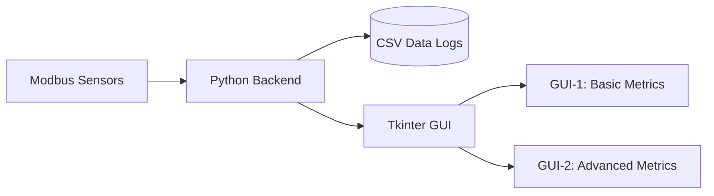

# Weather Station Dashboard System  

**A Python-based dual-GUI weather monitoring system with Modbus sensor integration, real-time data visualization, and logging.**  

---

## Table of Contents  
1. [Overview](#overview)  
2. [Features](#features)  
3. [System Architecture](#system-architecture)  
4. [Installation](#installation)  
5. [Configuration](#configuration)  
6. [Usage](#usage)  
7. [Function Categories](#function-categories)  
8. [Key Bindings](#key-bindings)  
9. [License](#license)  

---

## Overview  
This project provides a **full-screen weather dashboard** with two interchangeable GUI views:  
- **GUI-1**: Basic metrics (temperature, humidity, wind speed/direction).  
- **GUI-2**: Advanced metrics (UV index, AQI, rainfall, sunrise/sunset).  

Data is collected from Modbus sensors, processed, and displayed in real-time. The system supports automatic GUI switching, manual overrides, and robust logging.  

---

## Features  
✅ **Dual-GUI Interface**: Toggle between simplified and detailed views.  
✅ **Modbus Sensor Integration**: Supports temperature, humidity, wind, rain, and UV sensors.  
✅ **AQI Calculation**: Converts PM2.5 readings to AQI with color-coded alerts.  
✅ **Sunrise/Sunset Times**: Pulls data from a CSV for accurate daylight tracking.  
✅ **Data Logging**: Stores sensor data in CSV files (with auto-cleanup).  
✅ **Debug Tools**: Coordinate mapping mode (`<F12>`) for GUI alignment.  

---

## System Architecture  


---

## Installation  
1. **Prerequisites**:  
   - Python 3.8+  
   - Libraries: `pymodbus`, `Pillow`, `pandas`, `tkinter`  
   ```sh  
   pip install pymodbus pillow pandas   
   ```  

2. **Clone the Repository**:  
   ```sh  
   git clone https://github.com/your-repo/weather-station.git  
   cd weather-station  
   ```  

3. **Run the System**:  
   ```sh  
   python awos.py  
   ```  

---

## Configuration  
Edit `weather_station.ini` to customize:  
- **Modbus**: Port, baud rate, sensor addresses.  
- **GUI**: Toggle interval, fonts, background images.  
- **Logging**: File paths, rotation policies.  

Example:  
```ini  
[modbus]  
port = /dev/ttyUSB0  
baudrate = 9600  

[gui]  
toggle_interval = 10000  # GUI switch delay (ms)  
```  

---

## Usage  
| Action                | Key Binding       |  
|-----------------------|-------------------|  
| Switch GUIs           | `<Tab>`           |  
| Pause GUI Toggle      | `<Space>`         |  
| Force Refresh         | `<F5>`            |  
| Debug Mapping Mode    | `<F12>`           |  
| Shutdown              | `<Escape>`        |  

---

## Function Categories  

### 1. **Initialization & Setup**  
| Function                | Description                                  |  
|-------------------------|----------------------------------------------|  
| `__init__`              | Initializes GUI, sensors, and logging.      |  
| `load_config`           | Loads INI file or defaults.                 |  
| `setup_logging`         | Configures log rotation.                    |  
| `init_modbus`           | Sets up Modbus client.                      |  

### 2. **GUI Management**  
| Function                | Description                                  |  
|-------------------------|----------------------------------------------|  
| `toggle_gui`            | Switches between GUI-1/GUI-2.               |  
| `update_gui1_widgets`   | Refreshes basic metrics (temp, wind, etc.). |  
| `update_static_elements`| Updates date/time/sun info.                 |  

### 3. **Sensor Handling**  
| Function                | Description                                  |  
|-------------------------|----------------------------------------------|  
| `read_environment_sensor` | Reads temp/humidity/pressure.              |  
| `process_rainfall`      | Tracks daily rainfall.                       |  
| `sensor_reader_loop`    | Thread loop for sensor polling.              |  

### 4. **Data Processing**  
| Function                | Description                                  |  
|-------------------------|----------------------------------------------|  
| `calculate_aqi`         | Converts PM2.5 to AQI.                       |  
| `get_uv_state`          | Returns UV risk level/color.                 |  
| `_degrees_to_cardinal`  | Converts wind degrees to compass direction.  |  

### 5. **Logging & Storage**  
| Function                | Description                                  |  
|-------------------------|----------------------------------------------|  
| `csv_writer_loop`       | Saves data to CSV files.                     |  
| `cleanup_old_logs`      | Deletes logs >7 days old.                    |  

### 6. **System Control**  
| Function                | Description                                  |  
|-------------------------|----------------------------------------------|  
| `shutdown`             | Stops threads and exits cleanly.             |  
| `force_update`          | Manual refresh of all data.                  |  

---

## License  
MIT License. See `LICENSE` for details.  

--- 

📌 **Note**: Ensure sensors are connected before launching. For troubleshooting, check `logs/weather_station_*.log`.  

--- 

**Author**: [aasifshahzad]  
**Repository**: [github.com/your-repo/weather-station](https://github.com/paakwin/multi_gui_awos)